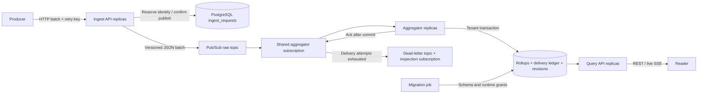
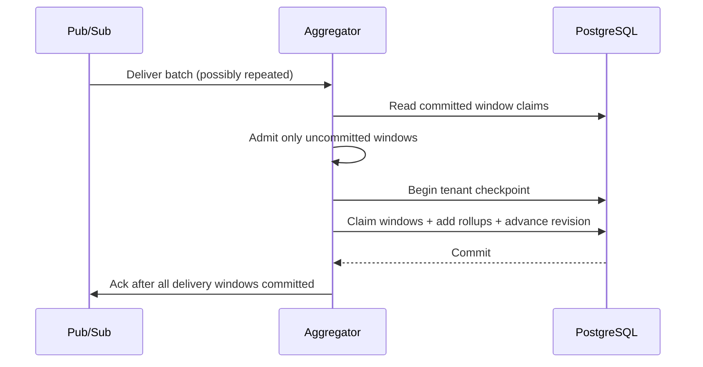

# Architecture and data guarantees

[Documentation index](README.md) · [Design decisions](adr/README.md)

## Pipeline

Ingest, aggregation, and reads are different binaries and scale independently.
PostgreSQL remains shared by retry reservations, aggregation, and queries; service
separation does not eliminate contention on that database. Pub/Sub decouples
short bursts and consumer outages from HTTP acceptance within its retention and
capacity limits. There is no synchronous write-to-query guarantee.

## Acceptance and identity

For a keyed HTTP batch, ingest first validates the request, meters its point
count, and constructs the accepted subset. PostgreSQL reserves the tenant/key,
raw-body fingerprint, batch ID, timestamps, and intended response before the
first publication. Competing requests reuse the winning reservation. Only a
confirmed broker publish followed by retry-record completion returns `202`.

A timeout can occur after the broker accepted the batch. The next retry publishes
the reserved batch identity again, and consumers suppress its duplicate
contributions. Completed reservations discard original points but preserve the
identity, fingerprint, and response until expiry. This bounds payload storage;
it also means those records are not a raw-event archive.

Without a retry key, each HTTP attempt has a fresh identity. A development process
without PostgreSQL uses only a process-local retry store. See
[safe retries](api.md#safe-retries) for the producer's obligations.

## Event-time windows and checkpoints

The engine groups observations by tenant, metric, kind, canonical labels, and
Unix-epoch-aligned tumbling window start, represented in UTC. The default width
is 60 seconds. Event
timestamps normalize to microsecond precision to match PostgreSQL identities.
Each series/window tracks count, sum, min, max, last value/event time, and optional
histogram buckets. No raw-observation query API is provided.

The event-time watermark follows the highest observed event time minus allowed
lateness and can advance on processing time after an idle period. It is an engine
scheduling aid, **not a global completeness guarantee**. Other replicas, delayed
messages, and valid backfill can still update an older window.

Workers checkpoint partial windows every 15 seconds by default, under receive
pressure at half the configured outstanding message/byte bound, or after an
engine admission rejection requests a flush. A checkpoint can expose data before
window closure. Later contributions add to the same stored row. A query or SSE
event is a snapshot of committed totals, not an immutable completed window.

Admission is all-or-nothing for the uncommitted portions of a delivery. Engine
series and estimated-byte limits cause retry instead of partial silent loss.
Subscriber limits bound messages and encoded bytes retained until settlement;
encoded bytes do not include all decoded Go allocations.

## Transactional duplicate suppression

The delivery ledger key is `(tenant_id, batch_id, window_start)`. It records each
batch's contribution to each window. A batch can span multiple windows, so a
single batch-level boolean would incorrectly suppress uncommitted windows after
a partial failure.

| Failure point | Outcome |
| --- | --- |
| Before checkpoint commit | No committed claim for those contributions; unacknowledged delivery can rebuild them |
| After commit, before broker ack | Redelivery finds the claims and skips those contributions |
| Another replica wins an overlapping claim | The losing tenant transaction rolls back; retry reconstructs only uncommitted windows |
| One tenant's transaction fails | Its deliveries retry; other successfully committed tenants can acknowledge independently |
| Ledger removed before old messages replay | Duplicate suppression is no longer guaranteed for those identities |

Claims and rollup writes use bounded 256-row SQL chunks inside **one transaction
per tenant**, not a commit per chunk. Upserts combine scalar statistics and
histogram counts. This is exactly-once accumulation for retained identities on
top of at-least-once delivery, not a claim that transport or HTTP requests execute
only once. It depends on durable PostgreSQL commits, consistent writer semantics,
unchanged identities, and sufficient ledger retention.

Ledger reads happen outside the shared admission lock. Checkpoint completion
invalidates a local read snapshot; the worker rereads within the original storage
deadline before admitting it. Engine mutation and pending-delivery bookkeeping
remain atomic. Cross-process races are resolved by transactional claims.

## Tenant concurrency and stream ordering

Each checkpoint can run four tenant transactions concurrently by default,
bounded by `AGGREGATOR_FLUSH_CONCURRENCY` and the existing database pool. A shared
storage deadline covers both queued and running tenant work. Successful tenants
acknowledge as they finish. Blocked transactions still occupy worker slots, queued
tenants can exhaust the deadline, and the next collection waits for the current
checkpoint to resolve. This is bounded isolation, not dedicated resources per
tenant.

Within each tenant, the writer locks `tenant_revisions` and advances its revision
in the same transaction as rollups. The row lock remains held through commit,
so revision order matches committed visibility. A database sequence or wall-clock
timestamp alone would not provide that ordering. One hot tenant still serializes
on this row even with multiple aggregator replicas.

The query worker reads changed rows using revision and a stable series/window
tie-break key. Only the latest rollup row is stored: several changes between polls
can coalesce. The SSE cursor is connection-local and is not exposed for replay.
Reconnects require REST reconciliation; see [live stream](api.md#live-stream).

## Storage model

| Table | Identity and responsibility |
| --- | --- |
| `rollups` | Primary key `(tenant_id, metric, kind, label_hash, window_start)`; labels, window end, scalar statistics, last event time, buckets, update time, revision |
| `processed_batches` | Primary key `(tenant_id, batch_id, window_start)`; commit-time delivery claims |
| `ingest_requests` | Primary key `(tenant_id, idempotency_key)`; fingerprint, batch identity, saved response, publish state, creation/expiry |
| `tenant_revisions` | One revision row per tenant; commit ordering for live updates |
| `schema_migrations` | Applied migration versions; restored consistently with application tables |

Indexes support tenant/metric time reads, JSONB label filters, revision scans,
and retention. The current schema is the result of **all seven migrations**;
`0001_rollups.sql` alone does not describe current primary keys or revisions.
Migrations are embedded in the binaries and serialized with an advisory lock.
There are no down migrations.

Tenancy is enforced by authenticated principals and SQL filters. Runtime database
roles separate services; they do not provide a database account or row-level
security policy for each tenant. Direct SQL access is an administrative boundary.

Retention deletes rollups by `window_end`, ledger entries by processing age, and
retry reservations by expiry. Cleanup uses 10,000-row transactions with locked
rows skipped and a 30-second budget per table per pass. It is eventual cleanup,
not an exact deletion timestamp. Revision rows are not a raw-event history and
are not included in those time-based pruning tables.

## Histograms

The layout has 150 positive buckets, base `1e-3`, growth factor `1.15`, plus
negative, zero, and overflow counters. The stored vector is
`[negative, zero, bucket0, ..., bucket149, overflow]`, length 153. Bucket upper
bound `i` is `0.001 * 1.15^(i+1)` in the metric's chosen units. The highest
positive boundary is approximately 1.27 million in those units.

Quantiles select the upper boundary containing the desired rank. They do not
interpolate or promise a universal percentage-error bound. Values at the lower
edge, all negative values, and overflow need special interpretation: negative
quantiles return zero and overflow clamps to the top boundary. Scalar count,
sum, min, max, and last still reflect those observations. Malformed or incompatible
bucket vectors are omitted from percentile results with a warning.

All writers must share the same histogram layout. Changing it requires an
explicit versioned data migration; adding vectors with different boundaries
would corrupt percentile meaning. See [ADR 4](adr/0004-fixed-histogram-layout.md).

## Broker envelope

The internal JSON envelope is version `"1"` and contains `schema_version`,
`batch_id`, `tenant_id`, `received_at`, and `points`. Points carry explicit
timestamps after HTTP normalization. Pub/Sub attributes include schema version,
tenant, batch ID, point count, publication time, and optional request ID; tracing
adds propagation context. The decoder validates bounds and supported schema
versions. Stored-message validation does not reject an otherwise valid observation
solely because it aged while waiting for delivery.

An invalid envelope is nacked for the subscription's dead-letter policy to
preserve; it is not acknowledged and discarded. Production replay must retain
the original envelope identities. The public ingest endpoint assigns a new
identity and therefore is not a substitute for broker replay. See
[dead-letter recovery](recovery.md#dead-letter-replay).

## Scaling boundaries

Horizontal workers share a subscription and the same ledger. This improves
available compute and failure recovery but does not remove database write,
connection, index, storage, or hot-tenant limits. Long query ranges and large
label sets increase read cost; bounded reads can truncate or reject instead of
exhausting memory. Label cardinality and window turnover determine stored row
growth, even at a modest point rate.

Read [capacity](capacity.md) for the measured workload method and
[recorded results](capacity-results.md) for observed profiles. Neither the default
replica count nor a short successful test defines a production SLA. In particular,
full-retention disk growth, autovacuum behavior, skewed tenants, failure recovery,
and real cloud networking need representative staging validation.

Source: [engine](../internal/aggregate/engine.go), [runner](../internal/aggregator/runner.go),
[tenant checkpoints](../internal/aggregator/tenant_flush.go),
[rollup transactions](../internal/store/rollups.go), [revisions](../internal/store/changed.go),
[migrations](../internal/store/migrations), and [envelopes](../internal/pubsubx/envelope.go).
